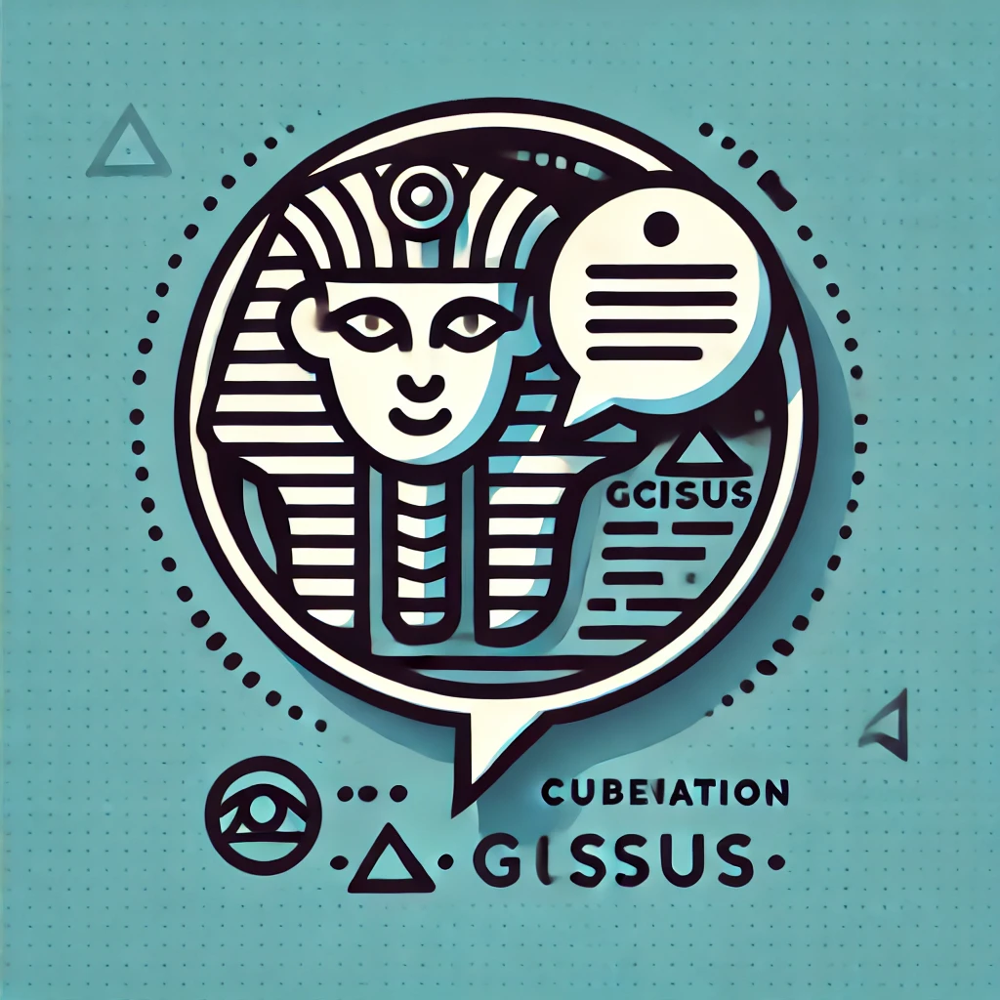

Welcome to sphinxcontrib-giscus's documentation!
================================================

Description
----------------------

This Sphinx extension allows users to dynamically integrate `Giscus`_ comments into specific pages of a
Sphinx-generated documentation website.

.. toctree::
   :maxdepth: 2
   :caption: Contents:

   usage/index
   config/index

.. _Giscus: https://giscus.app/zh-CN